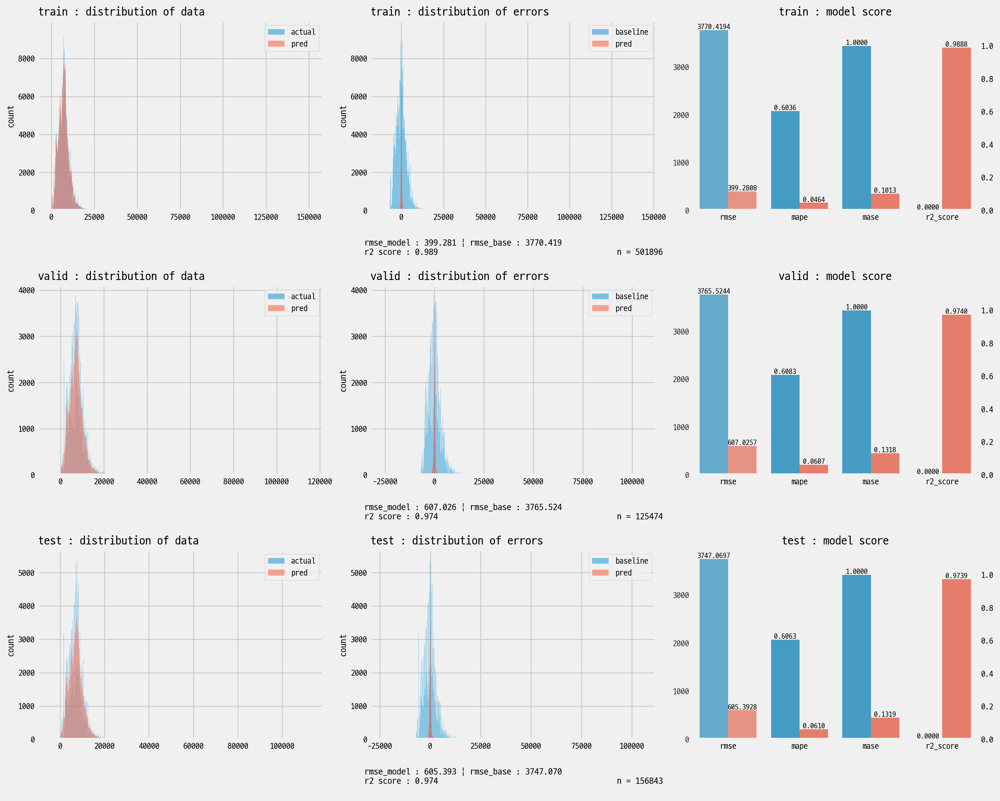
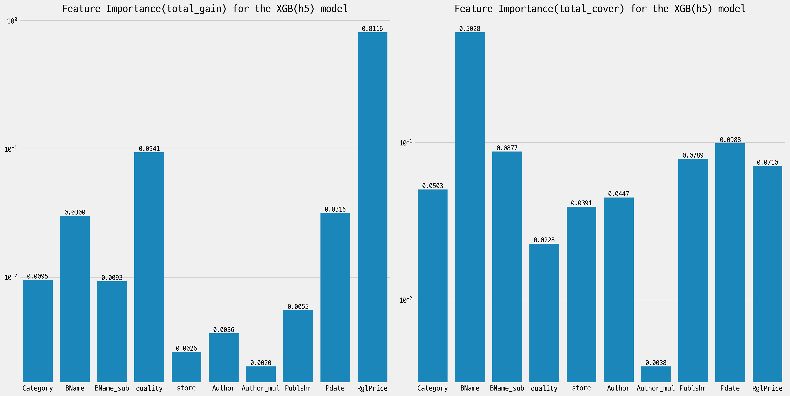
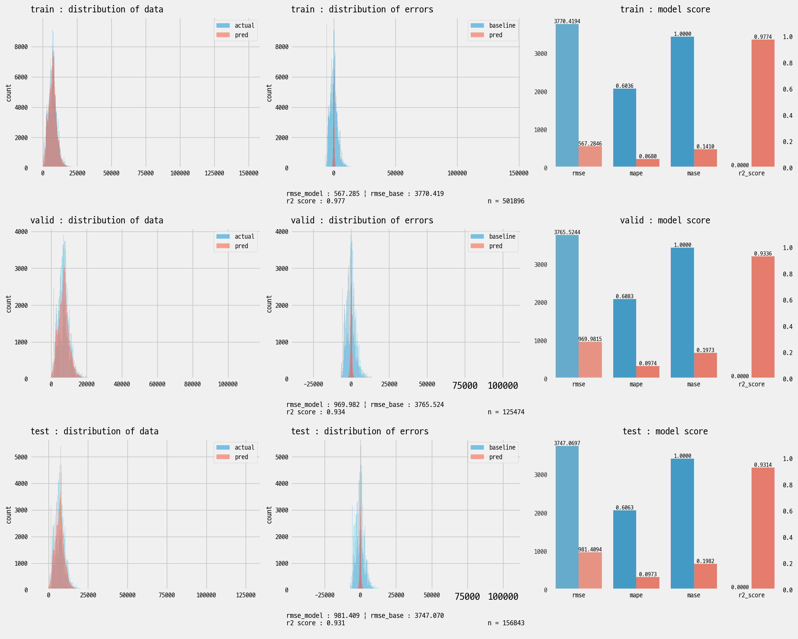
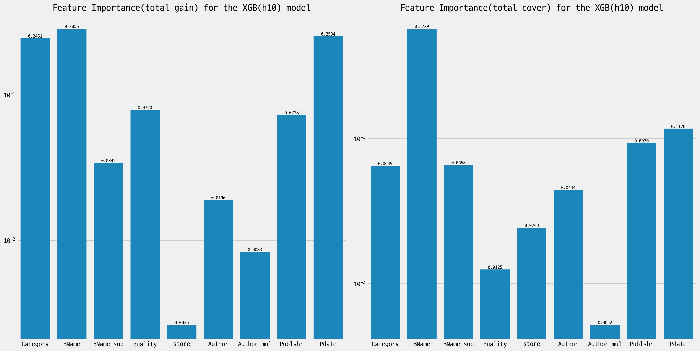

# 알라딘 중고 도서 데이터셋 구축 및 그에 기반한 중고 서적 가격 예측 모델

프로젝트 구성원: 오도은, 박예림, 이준성, 정홍섭 / [발표 슬라이드](https://docs.google.com/presentation/d/15EIOMGpadZQf3cT2k0pfClS9DVICLmmf5ZTH1k4XnKc/edit?usp=sharing)

**사용된 스킬 셋**: NumPy, Pandas, Matplotlib, Beautifulsoup, re, Scikit-learn, xgboost, [Mecab](https://pypi.org/project/python-mecab-ko/)

## 1. 프로젝트 개요

### 배경

- 중고 도서의 상태, 저자, 장르 등 다양한 요소를 기반으로 중고 도서의 판매 가격이 형성됨
- 중고 도서 가격은 상품의 종류 및 상태 별로 가격의 편차가 있음
- 가격에 중요한 요소들의 내용은 쉽게 확인 가능하고, 상품 페이지에 정리가 잘 되어있는 편
  - 크롤링을 통해 데이터셋을 구축하기에 접근성이 좋음

### 목표

- 크롤링을 통해 알라딘 중고도서 데이터 셋 구축
- 알라딘 중고 매장에서 판매하는 중고 도서 가격을 예측하는 회귀 모델 개발
  - 알라딘 홈페이지에서 판매하는 중고도서 중 중고 매장에서 판매하는 상품을 우선적 대상으로 함
  - Random Forest Regressor, XGBoost 등의 다양한 모델을 이용
- 각 모델의 성능을 여러 성능 지표 및 실험을 통하여 적절히 평가

## 2. 데이터 셋

### 1) 개요

- 알라딘의 중고 도서 상품과 새 책 사이에 url 구조 등으로는 알라딘의 중고 도서와 새 책 사이에 구별할 수 없음
- 알라딘에서 도서별로 중고 상품을 정리해 놓은 페이지를 이용하여 데이터 셋을 체계적으로 구축

### 2) 구성

#### [알라딘 주간 베스트셀러 데이터](https://www.aladin.co.kr/shop/common/wbest.aspx?BranchType=1)

- 알라딘의 주간 베스트셀러 페이지에서 제공한 1~1000위에 대한 xls 파일 데이터를 이용하여 구성
- 2000년 1월 1주차 ~ 2024년 7월 2주차까지의 데이터를 포괄하며, 24-07-00에 수집 진행

*<b>도표.</b> 알라딘 주간 베스트셀러 페이지 예시*

- 총 1,415,586개의 row와 랭킹, 구분, 도서 명, ItemId, ISBN13, 부가기호, 저자, 출판사, 출판일, 정가, 판매가, 마일리지, 세일즈 포인트, 카테고리, 날짜 12개의 column
  - **구분** : 국내도서, 외국도서 등으로 구분되어 있음
  - **ItemId** : 알라딘에서 부여한 해당 도서의 id. 숫자로만 구성
    - 새 책 기준의 id 값이 기재됐고, 한정판, 개정판 등의 경우도 별도의 id가 부여 됨
    - raw data에는 도서 외에도, 당시 베스트셀러였던 MD 굿즈, 강연 등도 포함되어 있음
  - **날짜, 랭킹** : 해당 도서가 어떤 주차의 주간 베스트셀러 목록에 몇 위로 올랐는지
    - 하나의 도서가 다양한 주 차에서 다양한 랭킹의 베스트셀러로 등장
  - [**ISBN13, 부가기호**](https://blog.aladin.co.kr/ybkpsy/959340) : ISBN13은 전세계에서 공통적으로 사용하는 도서에 대한 id. 발행자 등의 정보가 포함되어 있음. 부가기호는 한국 문헌 보호 센터에서 부여하는 번호로, 예상 독자층에 대한 정보 등이 포함 되어 있음
  - **카테고리** : 도서가 어떤 장르에 속하는지에 대한 정보. 외국어, 종교, 사회과학, 건강/취미 등 총 24개 유형으로 분류
  - **세일즈 포인트**
    - 판매량과 판매기간에 근거하여 해당 상품의 판매도를 산출한 알라딘만의 판매지수이며, 매일 업데이트 됨
    - 최근 판매분에 가중치를 두어, 팔릴수록 올라가고 덜 팔리면 내려감
    - 최근 베스트셀러는 점수가 높으며, 꾸준히 팔리는 스테디셀러들도 어느 정도 점수를 유지
- 날짜 및 랭킹을 제외하고, 판매가, 세일즈 포인트 등은 크롤링 시점에서의 값이 저장됨

*<b>도표.</b> 알라딘 주간 베스트 셀러*

#### [알라딘 중고 도서 데이터](https://www.aladin.co.kr/shop/UsedShop/wuseditemall.aspx?ItemId=254468327&TabType=3&Fix=1)

*<b>도표.</b> 도서 별 중고 매물 목록 페이지 예시*

<!--위의 탭을 포함하는 이미지로 업데이트 필요-->

- 알라딘 중고 도서는 판매자 별로 셋으로 분류 됨
  1. 알라딘 직접 배송 : 중고매장에서 판매하고 있지 않은 중고 도서
  2. 알라딘 온라인 중고매장 : 오프라인의 알라딘 중고 매장에서 판매되고 있는 중고 도서
  3. 판매자 중고 : 판매자가 알라딘이 아닌 중고 도서
- [알라딘 온라인 중고매장(광활한 우주점)](https://www.aladin.co.kr/usedstore/wonline.aspx?start=we)에 등록 된 중고 도서 매물로 한정
  - 도서멸 중고 매물 목록 페이지 url 구조 상, 새 책의 ItemId를 이용하여 접근할 수 있음
  - 판매자 분류를 기준으로 탭이 나눠져 있으며, 알라딘 중고 매장도 그 중 하나의 탭
- 위의 베스트셀러 데이터에 포함된 도서(ItemId)를 기준으로 크롤링한 중고도서 매물 자료

*<b>도표.</b> 알라딘 중고 도서 데이터*

- 총 784,213개의 row, 7개의 column으로 구성.
  - 각 row 당 중고 도서 매물 하나에 해당
    - 103,055 종의 도서에 대한 중고도서 매물 784,213건
  - ItemId (새 책 기준), 중고 번호, 중고 등급, 판매지점, 배달료, 중고가, 판매 url
  - **ItemId** : ItemId는 중고 도서를 포함하여 모든 상품에 각각 부여되기 때문에, 책 종류를 구별하려면 새 책 기준 ItemId를 사용해야 함
  - **중고 번호** : 해당도서의 중고도서 목록 페이지에 있었던 순서
  - **중고가, 품질**
    - 중고가는 품질(중고 등급)의 큰 영향을 받으며, '균일가' 및 '하', '중', '상', '최상'으로 구분되어 있음
    - 품질이 높을수록 중고가가 높은 경향이 있음
    - 같은 품질이라도 가격이 다르거나, 낮은 품질의 매물보다 더 가격이 싼 경우가 종종 있음
  - **판매 url** : 해당 중고 매물에 대한 판매 페이지. 해당 중고 매물의 ItemId가 url에 포함되어 있음

- 위 2개의 데이터를 종합하여 데이터셋을 만들어 프로젝트를 진행
- 종합된 데이터 셋에서는 ItemId, 도서 명, 중고 등급, 판매 지점, 저자, 출판사, 출판일, 정가, 판매가, 세일즈포인트, 카테고리, 중고가 총 12개를 column으로 사용

*<b>도표.</b> 데이터 셋들에 포함된 주요 column 및 그에 대한 개요*

## 3. 문제 설정

**목표**: 품질, 판매 지점, 저자, 출판사, 출판일, 정가 등의 값을 이용하여 알라딘에서 공식으로 판매하는 중고 서적 가격을 예측 하고 분석하고자 함

### 1) 종속 변수/ 독립 변수

- 종속 변수를 제외한 항목 중에서 총 11개의 독립변수 선정
  - BName_sub (도서명에서 괄호 안의 내용), Author_mul (저자 등이 여러 명으로 표기되었는지 여부) 등 파생 항목 포함. 해당 내용은 전처리 파트에서 후술

  | 종속 변수 | 독립 변수 |
  |---------|---------|
  | Price | quality, store, BName, BName_sub, Author, Author_mul, Publshr, Pdate, RglPrice, Category, SalesPoint |

  *<b>도표.</b> 모델의 종속 변수 및 독립 변수*

### 2) 실험 설계

- sklearn을 이용하여 train 64%, validation 16%, test 20% 비율로 분리
  - train : 95,061종의 도서에 대한 중고도서 501,896건
  - valid : 62,995종의 도서에 대한 중고도서 125,474건
  - test : 69,385종의 도서에 대한 중고도서 156,843건
- XGBoost Regressor(이하 XGB)을 학습시킬 때 높은 성능을 내는 hyperparameter 탐색
- 크게 세 가지 측면으로 실험 진행
  - Grid search를 이용해 각 실험 별로 가장 높은 성능을 내는 hyper parameter 탐색
  - 정가와 SalesPoint를 학습에서 제외시켜도 안정적인 성능이 나오는지 탐색
  - train set에 포함되지 않았던 도서들에 대한 중고 매물로 test 대상을 한정지었을 때, 성능이 어떻게 달라지는지 탐색
- RMSE, MAPE, R2 Score 등의 회귀 평가 지표를 사용하여 성능을 각 모델 별로 분석

## 4. [전처리](./code/)

### 1) 전체 과정

#### [베스트 셀러 목록 전처리](./code/step2_preprocess_bookinfo.py)

- 결측치 처리
  - 저자 명, 구분, 출판사, 카테고리 등에 결측치가 있는 행의 개수 1,214개
    - 실제 도서도 있지만, MD 굿즈, 강연등 도서가 아닌 데이터 다수 존재
- 중복 도서 처리 : 베스트 셀러 목록에 여러 번 오른 도서는 하나의 행만 남김
- [도서 명](./research/240716_check_bookinfo.ipynb)
  - 한자 처리
    - [hanja](https://github.com/suminb/hanja)을 이용해 한자를 한글로 변환. 한글 독음이 이미 있는 경우 중복되지 않게 처리
  - 숫자 처리
    - 숫자 사이 구분자 "," 정리 : ex) "1,000" -> "1000"
    - 로마 숫자를 아랍 숫자로 변환
    - 연도 표기 정리 : "\`00"의 형태로 표기된 년도를 정리
      - ex) "\`98 ~ \`07 기출문제 모음" -> "1998 ~ 2007 기출문제 모음"
  - 특수한 unicode로 기입된 문자를 흔히 쓰이는 특수문자로 변환
    - "&#"가 들어가는 token들이 있는지 확인 후 별도 처리
    - ex) "세 명의 삶 ＼ Q. E. D." -> "세 명의 삶 \ Q. E. D."
  - 괄호속 내용 추출 후 BName_sub column에 정리
    - ex) "전지적 루이 &후이 시점(양장본)" -> "(양장본)"만 BName_sub에 분리
- [저자 명](./research/240716_check_bookinfo2.ipynb)
  - 여러 명이 제작자로 기재된 경우, 맨 앞의 제작자만 남김
    - 여러 명이 기재되어 있었는지 여부를 Author_mul에 bool형태로 기록
      - ex) "정홍섭 글 이준성 그림" -> "정홉섭 글", True
  - 이름 뒤에 붙은 기타 문자열 처리
    - 역할에 대한 단어 : "글", "시", "역", "지음", "평역" 등 총 72가지
    - 다수의 사람이 참여했다는 의미의 단어
      - ex) "외 13인", "외 5명", "외"
- 출간일 : DateTime 타입으로 파싱
- ItemId, 정가, 판매가 : 정수 형태로 변환

#### [중고 도서 목록 전처리](./code/step3_preprocess_usedinfo.py)

- 이상치 처리:
  - 알라딘 페이지에서 '최상', '상', '중' 등급이 있는 것으로 안내하지만, '균일가', '하' 등급도 소수 존재
  - '균일가', '하'는 [하]로 통일
- 배달료 : 2500원으로 통일되어 있어 삭제

#### [인코딩 및 스케일링](./research/240716_encoding_bookinfo.ipynb)

- validation 및 test set의 데이터가 전처리에 영향을 주지 않도록 주의하여 진행
  - train set을 전처리 하면서 결정된 함수 및 관련 내용들을 validation 및 test set에 일괄적으로 적용
- Mecab을 사용해 Category, BName,BName_sub 컬럼을 토큰화
  - [Mecab](https://pypi.org/project/python-mecab-ko/)은 원문 내 띄어쓰기에 의존하기보다 사전을 참조해 어휘를 구분하여 안정적인 결과값을 보여줌
- 도서 명(BName, BName_sub)과 카테고리는 하나의 코퍼스로 통합하여 정수 인코딩
  - 글의 내용이 되는 문장이 아닌 제목이므로, train set의 해당 열에 포함 된 최대한 모든 토큰을 데이터 셋에 포함
  - TF-IDF를 이용한 토큰 정리, 품사나 길이를 기준으로 정리하는 방법 등은 적용하지 않음
- 출판사, 판매 지점, 저자 명에 대해서는 빈도 수 혹은 SalesPoint를 고려한 인기를 반영하여 정수 인코딩
- 날짜 관련 데이터 정수형으로 인코딩
- MinMaxScaling 진행
  - 도서 명과 카테고리 관련 열은 일괄적으로 진행
  - 이외의 열은 개별적으로 진행

  

  *<b>도표.</b> 전처리,스케일링후 최종 데이터 예시*

## 5. 모델 학습 및 결과

### 개요

- 모델 성능은 RMSE, MAPE, R2 Score 등을 활용하여 평가
- Random Forest Regressor, XGBoost 모델 간의 성능을 비교
  - XGBoost에 대해서는 GridSearchCV를 이용해 각 모델 별로 가장 높은 성능을 내는 hyper parameter 탐색
- 각 모델 별로 4 종류의 상황에 대한 실험을 진행
  - Expt. 1 : 모든 종속변수를 이용해 중고도서 가격 예측
    - 종속변수 : Category, BName, BName_sub, quality, store, Author, Author_mul, Publshr, Pdate, RglPrice, SalesPoint
  - Expt. 2 : 세일즈포인트를 제외한 종속변수를 이용해 중고도서 가격 예측
  - Expt. 3 : 세일즈포인트와 정가를 제외한 종속변수를 이용해 중고도서 가격 예측
  - Expt. 4 : 세일즈포인트와 정가를 제외한 종속변수를 이용해 중고도서 할인율 예측
- 모델 평가는 두 가지 방법으로 진행
  - test1 : 초기에 test dataset으로 설정된 데이터셋
    - 69,385종의 도서에 대한 중고도서 156,843건
  - test2 : train set에 포함된 적 없는 도서에 대한 중고 매물로 제한한 데이터셋
    - test set에서 4,984종의 도서에 대한 중고도서 5,968건
- 판매가와 SalesPoint를 학습에서 제외시켜도 안정적인 성능이 나오는지 탐색

### [GridSearchCV를 통한 hyperparmeter 선정](./research/240721_GridSearch_for_XGB.ipynb)

#### 설계

- 각 실험에 대해 GridSearchCV를 진행한 후, 가장 성적이 높았던 7개의 hyperparameter들을 후보로 삼음
  - 총 486개의 hyperparameter 중에 총 14개의 후보를 고름
- hyperparameter
  - 고정 hyperparameter
    - fold = 3
    - early_stopping_rounds : num_boost_rounds에 따라 logistic하게 변하도록 설정

      |num_boost_rounds|100|1500|2500|
      |:-:|-:|-:|-:|
      |early_stopping_rounds|30|48|51|

      *<b>도표.</b> early_stopping_rounds 설정값*

  - 대상 hyperparamter 및 범위
    - *num_boost_round* : [100, 1500, 2500]
    - *learning_rate* : [0.5, 0.3, 0.1]
    - *max_depth* : [4, 5, 6]
    - *min_child_weight* : [1, 4, 7]
    - *colsample_bytree* : [0.5, 1]
    - *subsample* : [0.4, 0.7, 1]

#### 우수 hyperparameter 및 성적

- 아래에는 각 실험 별로 가장 성적이 높았던 4개의 hyperparameter에 대한 평가 결과를 정리
- *Expt. 1* : 제외한 종속 변수 없이 중고가 예측

  ||**h2**|h3|h5|h6|
  |-|-:|-:|-:|-:|
  |num_boost_round|*2500*|2500|2500|2500|
  |learning_rate|*0.3*|0.3|0.3|0.3|
  |max_depth|*6*|6|6|6|
  |min_child_weight|*1*|1|4|7|
  |colsample_bytree|*0.5*|1|1|0.5|
  |subsample|*1*|1|1|1|
  |mean valid score|**_0.97207_**|0.97172|0.97163|0.97145|

  *<b>도표.</b> 제외한 종속 변수 없는 상황에서 best parameter 및 R2 score*

- *Expt. 2* : SalesPoint 제외하고 중고가 예측

  ||**h2**|h3|h4|h7|
  |-|-:|-:|-:|-:|
  |num_boost_round|*2500*|2500|2500|2500|
  |learning_rate|*0.3*|0.3|0.3|0.3|
  |max_depth|*6*|6|6|6|
  |min_child_weight|*1*|1|1|7|
  |colsample_bytree|*0.5*|1|1|1|
  |subsample|*1*|1|1|1|
  |mean valid score|_**0.97139**_|0.97110|0.97058|0.97049|

  *<b>도표.</b> SalesPoint 제외한 상황에서 best parameter 및 R2 score*

- *Expt. 3* : SalesPoint, 정가(RglrPrice) 제외하고 중고가 예측

  ||h9|**h10**|h12|h13|
  |-|-:|-:|-:|-:|
  |num_boost_round|2500|*2500*|2500|2500|
  |learning_rate|0.5|*0.5*|0.5|0.5|
  |max_depth|6|*6*|6|6|
  |min_child_weight|1|*1*|4|7|
  |colsample_bytree|1|*0.5*|1|1|
  |subsample|1|*1*|1|1|
  |mean valid score|0.89100|**_0.89926_**|0.89525|0.89449|

  *<b>도표.</b> SalesPoint, RglPrice 제외한 상황에서 best parameter 및 R2 score*

- *Expt. 4* : SalesPoint, 정가(RglPrice) 제외하고 할인율 예측

  ||h9|h3|**h5**|h7|
  |-|-:|-:|-:|-:|
  |num_boost_round|2500|2500|*2500*|2500|
  |learning_rate|0.5|0.3|*0.3*|0.3|
  |max_depth|6|6|*6*|6|
  |min_child_weight|1|1|*4*|7|
  |colsample_bytree|1|1|*1*|1|
  |subsample|1|1|*1*|1|
  |mean valid score|0.79814|0.79872|**_0.79887_**|0.79823|

  *<b>도표.</b> SalesPoint, RglPrice 제외하고 할인율 예측할 때 best parameter 및 R2 score*

### [XGB 모델 학습 및 평가](./research/240721_hyperparameters_XGB.ipynb)

#### XGB 평가에 최종적으로 사용 된 hyperparmeter

- GridSearchCV를 통해 고른 14개의 hyperparmeter와 default 값(h0)에 대해서 테스트 진행

  ||h0|h1|h2|h3|h4|h5|h6|
  |:-|-:|-:|-:|-:|-:|-:|-:|
  |num_boost_round|100|1500|2500|2500|2500|2500|2500|
  |learning_rate|0.3|0.3|0.3|0.3|0.3|0.3|0.3|
  |max_depth|6|6|6|6|6|6|6|
  |min_child_weight|1|4|1|1|4|4|7|
  |colsample_bytree|1|1|0.5|1|0.5|1|0.5|
  |subsample|1|1|1|1|1|1|1|

  ||h7|h8|h9|h10|h11|h12|h13|h14|
  |:-|-:|-:|-:|-:|-:|-:|-:|-:|
  |num_boost_round|2500|2500|2500|2500|2500|2500|2500|2500|
  |learning_rate|0.3|0.5|0.5|0.5|0.5|0.5|0.5|0.5|
  |max_depth|6|5|6|6|6|6|6|6|
  |min_child_weight|7|1|1|1|4|4|7|7|
  |colsample_bytree|1|1|0.5|1|0.5|1|1|0.5|
  |subsample|1|1|1|1|1|1|1|1|

  *<b>도표.</b> XGB 평가에서 최종적으로 사용한 hyperparmeter 목록*
  
#### 평가 기준

- metric : RMSE, MAPE, $R^2$ score
- 각 metric에 대해 test1과 test2에서의 값에 조화 평균을 취한 값을 기준으로, 각 metric 별 순위를 매김
  - 산술, 기하 평균에 비해 조화 평균은 값들 간의 차이가 크지 않은 것을 상대적으로 높게 평가
  - training set에 포함됐는지 여부에 큰 차이 없이 고르게 잘 예측하는 모델을 목표로 하기 때문에 조화 평균을 사용
- metric 별 성능 순위 간에 조화 평균을 구한 뒤 순위를 메겨, 실험 별로 각각 모델들의 순위 및 best model을 결정

#### 모델 평가

- 가독성을 고려하여 15개의 hyperparameter 중 각 실험에서 3위 안에 든 hyperparameter의 모음에 default(h0)를 포함한 8종에 대한 결과만 추려서 정리
- *Expt.1*
  - 학습 결과

  | **test1**|        h0 |        h1 |        h2 |        h3 |        h5 |        h7 |       h10 |       h12 |
  |:---------|----------:|----------:|----------:|----------:|----------:|----------:|----------:|----------:|
  | RMSE     | 791.45    | 624.77    | 610.14    | 605.39    | 612.01    | 611.04    | 629.77    | 631.19    |
  | MAPE     |   0.08123 |   0.06398 |   0.06264 |   0.06101 |   0.06162 |   0.06168 |   0.06322 |   0.06335 |
  | R2_SCORE |   0.95539 |   0.9722  |   0.97349 |   0.9739  |   0.97332 |   0.97341 |   0.97175 |   0.97163 |
  
  *<b>도표.</b> Expt.1에서 test set으로 평가한 결과*

  | **test2**|         h0 |         h1 |         h2 |         h3 |         h5 |         h7 |        h10 |        h12 |
  |:---------|-----------:|-----------:|-----------:|-----------:|-----------:|-----------:|-----------:|-----------:|
  | RMSE     | 1461.59    | 1461.72    | 1463.05    | 1477.96    | 1469.03    | 1499.15    | 1606.71    | 1607.75    |
  | MAPE     |    0.13294 |    0.14177 |    0.15186 |    0.14469 |    0.14524 |    0.14276 |    0.1594  |    0.1551  |
  | R2_SCORE |    0.91175 |    0.91174 |    0.91158 |    0.90977 |    0.91085 |    0.90716 |    0.89336 |    0.89322 |
  
  *<b>도표.</b> Expt.1에서 test set 중 train set에 포함된 적 없는 종류의 도서들에 대해 평가한 결과*

  | **평균** |         h0 |        h1 |        h2 |       <b> h3</b> |        h5 |        h7 |       h10 |       h12 |
  |:---------|-----------:|----------:|----------:|-----------------:|----------:|----------:|----------:|----------:|
  | RMSE     | 1026.86    | 875.38    | 861.15    | <b>858.95   </b> | 864.05    | 868.21    | 904.87    | 906.49    |
  | MAPE     |    0.10084 |   0.08817 |   0.0887  | <b>  0.08583</b> |   0.08653 |   0.08614 |   0.09053 |   0.08996 |
  | R2_SCORE |    0.93306 |   0.941   |   0.94152 | <b>  0.94074</b> |   0.94105 |   0.93912 |   0.93091 |   0.93078 |
  | 종합순위 |   11       |   4       |   1       | <b>  0      </b> |   2       |   3       |   9       |   8       |

  *<b>도표.</b> Expt.1에서 두 평가에 대해 조화평균을 취하고 순위를 매긴 결과*

  - Best model
    - hyperparameter : h3
      - *num_boost_round* : 2500
      - *learning_rate* : 0.3
      - *max_depth* : 6
      - *min_child_weight* : 1
      - *colsample_bytree* : 1
      - *subsample* : 1

    
    *<b>도표.</b> Expt.1의 test1에서 best model의 예측값 및 오차 분포와 성능*

    
    *<b>도표.</b> Expt.1의 best model의 feature importance*

- *Expt.2*
  - 학습 결과

  | **test1**|        h0 |        h1 |        h2 |        h3 |        h5 |        h7 |       h10 |       h12 |
  |:---------|----------:|----------:|----------:|----------:|----------:|----------:|----------:|----------:|
  | RMSE     | 811.29    | 627.17    | 617.09    | 622.17    | 610.71    | 611.44    | 651.01    | 651.38    |
  | MAPE     |   0.08259 |   0.06514 |   0.06445 |   0.06215 |   0.06243 |   0.06266 |   0.06339 |   0.06427 |
  | R2_SCORE |   0.95312 |   0.97199 |   0.97288 |   0.97243 |   0.97344 |   0.97337 |   0.96982 |   0.96978 |

  *<b>도표.</b> Expt.2에서 test set으로 평가한 결과*

  | **test2**|         h0 |         h1 |         h2 |         h3 |         h5 |         h7 |        h10 |        h12 |
  |:---------|-----------:|-----------:|-----------:|-----------:|-----------:|-----------:|-----------:|-----------:|
  | RMSE     | 1569.41    | 1438.37    | 1482.96    | 1588.16    | 1440.4     | 1445.24    | 1746.74    | 1718.45    |
  | MAPE     |    0.13521 |    0.1431  |    0.15337 |    0.14704 |    0.14448 |    0.14406 |    0.15631 |    0.15414 |
  | R2_SCORE |    0.89826 |    0.91454 |    0.90916 |    0.89581 |    0.91429 |    0.91372 |    0.87396 |    0.87801 |

  *<b>도표.</b> Expt.2에서 test set 중 train set에 포함된 적 없는 종류의 도서들에 대해 평가한 결과*

  | **평균** |         h0 |        h1 |        h2 |        h3 |      <b>  h5</b> |        h7 |      h10 |       h12 |
  |:---------|-----------:|----------:|----------:|----------:|-----------------:|----------:|---------:|----------:|
  | RMSE     | 1069.64    | 873.48    | 871.52    | 894.07    | <b>857.75   </b> | 859.33    | 948.51   | 944.67    |
  | MAPE     |    0.10254 |   0.08953 |   0.09076 |   0.08737 | <b>  0.08718</b> |   0.08733 |   0.0902 |   0.09072 |
  | R2_SCORE |    0.92488 |   0.94239 |   0.93994 |   0.93255 | <b>  0.94294</b> |   0.9426  |   0.9194 |   0.92162 |
  | 종합순위 |   14       |   2       |   3       |   4       | <b>  0      </b> |   1       |   8      |  10       |

  *<b>도표.</b> Expt.2에서 두 평가에 대해 조화평균을 취하고 순위를 매긴 결과*

  - Best model
    - hyperparameter : h5
      - *num_boost_round* : 2500
      - *learning_rate* : 0.3
      - *max_depth* : 6
      - *min_child_weight* : 4
      - *colsample_bytree* : 1
      - *subsample* : 1

    
    *<b>도표.</b> Expt.2의 test1에서 best model의 예측값 및 오차 분포와 성능*

    
    *<b>도표.</b> Expt.2 의 best model의 feature importance*

- *Expt.3*
  - 학습 결과

  | **test1**|         h0 |         h1 |         h2 |         h3 |         h5 |         h7 |       h10 |       h12 |
  |:---------|-----------:|-----------:|-----------:|-----------:|-----------:|-----------:|----------:|----------:|
  | RMSE     | 1978.75    | 1173.79    | 1081.24    | 1030.94    | 1040.43    | 1060.22    | 981.41    | 995.98    |
  | MAPE     |    0.1986  |    0.12    |    0.10984 |    0.10306 |    0.10446 |    0.10569 |   0.09728 |   0.09868 |
  | R2_SCORE |    0.72113 |    0.90187 |    0.91673 |    0.9243  |    0.9229  |    0.91994 |   0.9314  |   0.92935 |

  *<b>도표.</b> Expt.3에서 test set으로 평가한 결과*

  | **test2**|         h0 |         h1 |         h2 |         h3 |         h5 |         h7 |        h10 |        h12 |
  |:---------|-----------:|-----------:|-----------:|-----------:|-----------:|-----------:|-----------:|-----------:|
  | RMSE     | 3324.69    | 3189.42    | 3262.41    | 3298.67    | 3180.58    | 3228.48    | 3428.1     | 3377.55    |
  | MAPE     |    0.40055 |    0.38649 |    0.38991 |    0.39703 |    0.3851  |    0.38697 |    0.42367 |    0.42468 |
  | R2_SCORE |    0.54339 |    0.57979 |    0.56034 |    0.55051 |    0.58212 |    0.56944 |    0.51455 |    0.52876 |  

  *<b>도표.</b> Expt.3에서 test set 중 train set에 포함된 적 없는 종류의 도서들에 대해 평가한 결과*

  | **평균** |         h0 |         h1 |         h2 |         h3 |         h5 |         h7 |       <b> h10</b> |        h12 |
  |:---------|-----------:|-----------:|-----------:|-----------:|-----------:|-----------:|------------------:|-----------:|
  | RMSE     | 2480.93    | 1716.03    | 1624.19    | 1570.92    | 1567.95    | 1596.25    | <b>1525.96   </b> | 1538.33    |
  | MAPE     |    0.26554 |    0.18313 |    0.17139 |    0.16364 |    0.16434 |    0.16603 | <b>   0.15823</b> |    0.16015 |
  | R2_SCORE |    0.61977 |    0.70583 |    0.69554 |    0.69004 |    0.71393 |    0.70345 | <b>   0.66289</b> |    0.67403 |
  | 종합순위 |   14       |    7       |   10       |    5       |    1       |    6       | <b>   0      </b> |    2       |

  *<b>도표.</b> Expt.3에서 두 평가에 대해 조화평균을 취하고 순위를 매긴 결과*

  - Best model
    - hyperparameter : h10
      - *num_boost_round* : 2500
      - *learning_rate* : 0.5
      - *max_depth* : 6
      - *min_child_weight* : 1
      - *colsample_bytree* : 1
      - *subsample* : 1

    
    *<b>도표.</b> Expt.2의 test1에서 best model의 예측값 및 오차 분포와 성능*

    
    *<b>도표.</b> Expt.3 의 best model의 feature importance*

## 6. 결과 분석

  ||Expt.1|Expt.2|Expt.3|
  |:-|-:|-:|-:|
  |hyperparameter|h3|h5|h10|
  |RMSE|858.95|857.75|1525.96|
  |MAPE|0.08583|0.08718|0.15823|
  |R2 SCORE|0.94074|0.94294|0.66289|

  *<b>도표.</b> 각 실험 별 best model과 성능*
  
- feature importance 분석 결과를 바탕으로 중고가 예측에 정가, 도서 명, 중고 등급 등이 주요한 역할을 하는 것을 확인
- 세일즈 포인트가 있을 때(Expt.1)가 없을 때(Expt.2, Expt.3)에 비해, default hyperparameter의 단순한 모델에서도 학습에서 본 적 없는 종류의 도서(test2)에 대해서도 예측 성능의 차이가 적었음
  - default hyperparameter가 아닌 경우, 세일즈 포인트를 제외해도 학습된 모델의 성능에 큰 차이가 없었음
  - h3의 경우 R2 SCORE과 RMSE로 보이는 성능이 다른 hyperparameter에 비해 떨어져도, MAPE에서는 더 높았음
    - test1에서만 MAPE의 성능이 다른 모델에 비해서 좋았던 것이 아니기 때문에, h1,h5,h7의 과적합이 방지된 모델을 더욱 튜닝하면 성능을 올릴 수 있을 것이라 유추할 수 있음
- num_boost_round가 큰 모델이 전반적으로 성능이 좋았으나, min_child_weight, colsample_bytree 등으로 과적합에 대해 방지된 모델들이 Expt.1, Expt.2의 test2에서 더 안정적인 결과가 나온 것을 확인
  - h1,h5,h7의 경우는 Expt.2와 Expt.1에서의 성적에 큰 차이가 없거나, Expt.2에서 더 좋은 성능을 보였음
  - 정가가 포함되지 않은 상황에서 할인율을 잘 맞추는(Expt.4에서 성능을 보인) hyperparameter가 Expt.1, Expt.2의 test2에서도 전반적으로 강건할 것이라는 예상이 아주 틀리지는 않았음
- GridSearchCV 과정 중에 더 높은 validation 성적을 보였던 경우가 항상 최고의 성능을 보이지는 않았음
  - 다만 상위권의 hyperparameter가 상위권의 성능을 유지하는 것을 확인했음
  - 또한 test2의 성능에 맞춰서 튜닝하기 위해서는 test2에 맞게 만들어진 validation set을 설정해야 함을 확인
- 정가를 학습 데이터에 포함하지 않았을 때, train set에 등장 한 적 없는 종류의 도서에 대해서는 중고 판매가 예측 성능이 많이 떨어지는 것을 발견
  - 정가가 포함되어 있는 경우 best model에서 total_gain 기준 feature importance가 매우 큰 것을 확인 할 수 있음
  - Expt.1, Expt.2에서 learning rate가 높은 hyperparameter는 과적합으로 성능이 좋지 않으나, Expt.3에서는 더 복잡한 모델이 필요하여 성능이 더 잘나온 것으로 유추할 수 있음

## 7. 결론 및 한계

### 결론

- default hyperparameter의 XGBoost 등 단순한 모델로도 높은 성능의 모델 개발 가능한 데이터 셋
  - 간단한 모델과 default hyperparmeter로도 높은 성능이 나오는 것으로 보아, 알라딘 중고매장에서 중고 도서 판매 가격을 산정하는 가이드라인이 있을 것이라 추측 가능
- 도서 명, 중고 등급, 정가, 출판일, 저자 등 실물 중고 도서에서 간단히 확인 가능한 특징만으로도 높은 성능이 충분히 가능
- 세일즈 포인트가 중고가 예측에 큰 도움을 줄 수 있으나, 더 높은 성능의 모델을 학습시키기 위해서는 모델의 복잡도를 높히되 과적합을 방지하는 쪽이 더 유리한 것을 확인 했음
- train set에서 중고 시세를 학습한 적 없는 종류의 도서에 대한 중고가에 대해서도 좋은 성능으로 예측한 것, best model들의 feature importance 등을 고려하면, NLP한 결과가 모델에 충분히 반영되었음을 알 수 있음
- validation set을 통해 hyperparameter 튜닝을 하기 위해서는, test set의 성질을 잘 대표해야 함을 확인함
  - 다만 validation set과 비슷한 성질을 가지지 않은 test set을 이용하여 어떤 모델이 더 강건할지 예측하는 것은 의미가 있음
- Neural Network를 이용한 더 복잡한 모델을 이용하면, 정가 없이 중고도서 할인율을 예측하거나 도서 정보로 정가를 예측하는 모델을 만들 때 더 높은 성능을 보일 수 있을 것이라 추측

### 한계 평가

- Grid Search보다 Bayesian Search 등 보다 효율적인 hyperparameter 탐색법을 이용했으면, 연산량을 보다 효율적으로 활용할 수 있었을 것이라 기대
- 정가를 데이터 셋에 포함하지 않는 상황에서도 성능을 높히는 것이 가능할 것 같으나 시도하지 못했음
  - 정가를 포함하지 않았을 때, train set에 없는 데이터에 대해서는 중고 판매가 예측 성능이 많이 떨어지는 것을 발견
  - XGB로는 한계가 있고, Neural Network를 이용해야 할 것으로 예상
- 저자명, 출판사를 인코딩 중 기타 항목으로 처리할 때 threshold 기준의 구체적인 근거를 제시하지 못 함
  - 알라딘의 Sales Point 및 개인적 경험에서의 인지도를 바탕으로 결정
  - 추가적인 조사를 통해 더 객관적이고 제시 가능한 근거 확립 가능

## 8. 추후 과제

- RNN 등 Neural Network를 이용한 회귀 모델 개발
- 배포 가능한 알라딘 중고도서 데이터 셋으로 확장
  - 중고 판매가 예측 모델 외에도 다양한 모델 개발 가능
    - 도서 정보 및 중고 시장에서의 가격을 바탕으로 알라딘의 SalesPoint 산정법 추정
    - 카테고리와 도서 명, 출판사 등의 정보로 출간 연도 예측
- 베스트 셀러 이외의 도서, 공식 매점에서 판매하지 않는 도서 등으로 데이터 셋 및 프로젝트 확장
  - 베스트 셀러에 포함된 적 없는 도서도 대상으로 하기 위한 크롤링 방법 개발 필요
